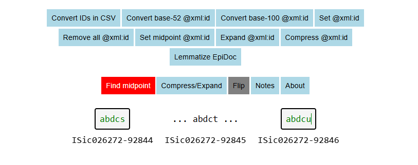

<div>
  
  
  
</div>
<br clear="all">




# Element ID generator and resolver for I.Sicily

This is a resolver and generator for token IDs on token elements in the [I.Sicily](https://github.com/ISicily/ISicily) corpus of inscriptions from ancient Sicily.

**NB At present full functionality is not available in Firefox.**

## I.Sicily element IDs

### Background

I.Sicily token IDs are underlyingly of the form ```ISic012345-12345```, where the first six digits ```012345``` correspond to the document ID; the five digits ```12345``` after the dash correspond to a number assigned to each token in the document. These are sequentially ordered through the document. However, to provide flexibility for the insertion of extra tokens in future, token IDs have a final ```0```, giving 9 extra IDs on each side for new elements, as they are needed. (It is, of course, highly unlikely that all this extra space will be needed.) 

For example ```ISic000001-00020``` would in in principle represent the second token in the document ```ISic000001```.

### Compressing IDs for use in XML documents

Placing such a long ID in an EpiDoc XML document significantly reduces readability. Accordingly, it is desirable to compress the ID, without losing any information. 
In XML documents, therefore, the IDs are compressed to a five-digit string consisting of
upper and lower case Roman characters, and upper and lower case Greek characters, i.e. ```A-Z```, ```a-z```, ```Α-Ω``` and ```α-ω```. For example, ```ISic000001-00020``` is represented as ```AAKAU```.

The compression is simply the numerical part of the underlying ID, as a single string, represented in Base 100, where the characters ```A-Z``` correspond to ```0-25``` in decimal, the characters ```a-z``` correspond to ```26-51```,  ```Α-Ω``` to ```52-76``` and ```α-ω``` to ```77-100```. The procedure is:

1. Remove non-numeric characters: ```ISic000001-00020 -> 00000100020```
2. Convert the resulting decimal number to Base 52: ```00000100020 -> 100020 -> KAU```
3. Pad the resulting string with the '0' character 'A' to make a five digit string, as necessary: ```KAU -> AAKAU```

### Maxima

A consequence of limiting the Base 100 representation to 5 digits is that the maximum decimal number that can be represented is lower than the theoretical maximum decimal number from an ISicily token ID, i.e. ```ISic999999-9999 -> 9999999999```. 

The maximum Base 100 number is ```ωωωωω```, which corresponds to ```9999999999 -> ISic099999-99999```.

### Converting from Base 52 IDs

Previously a particular implementation of Base 52 was used to render IDs (see https://github.com/rsdc2/ISicID). It is possible to convert between these ID systems. To do this, click the button "Convert old IDs". This will load a dialog box where you can choose a CSV file containing the IDs you wish to convert.

The CSV file must adhere to the following format:

- The file must have only one column;
- The first line of the CSV file must specify the Base of the source ID (currently either 52 or 100);
- The second line of the CSV file must specify the Base of the destination ID (currently either 52 or 100)

## Running and building

### On Github Pages

Follow this link:

[https://rsdc2.github.io/isicily-element-ids/](https://rsdc2.github.io/isicily-element-ids/)

### Running locally

- Clone the repository:

```
git clone https://github.com/rsdc2/isicily-element-ids.git
```

- Cd into the cloned directory:

```
cd isicily-element-ids
```

- Install dependency ([```http-server```](https://www.npmjs.com/package/http-server)):

```
npm install
```

- Run the server locally:

```
npx http-server
```

- Open localhost according to the message provided by ```http-server```:

```
http://localhost:8080/
```


### Building

The Element ID resolver / generator is written in Vanilla JavaScript. No building is required.

### Running the tests

From the repository root directory:

```
node --test
```

## Dependencies

The Element ID resolver / generator requires:

1. [`http-server`](https://www.npmjs.com/package/http-server) (MIT, see LICENSES folder) to run locally;
2. [`jsdom`](https://github.com/jsdom/jsdom) (MIT, see LICENSES folder) to run tests.

## Acknowledgements

The software for the ISicily Element ID resolver / generator was written by Robert Crellin as part of the Crossreads project at the Faculty of Classics, University of Oxford, and is licensed under the MIT license. This project has received funding from the European Research Council (ERC) under the European Union’s Horizon 2020 research and innovation programme (grant agreement No 885040, “Crossreads”).
